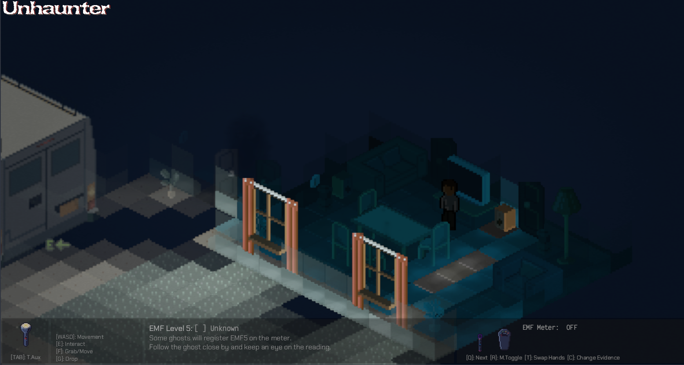
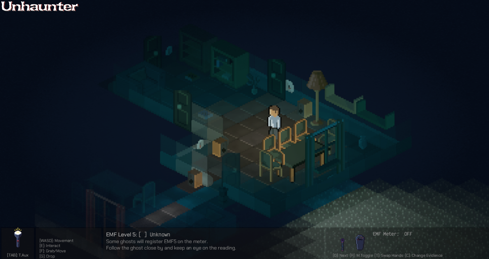
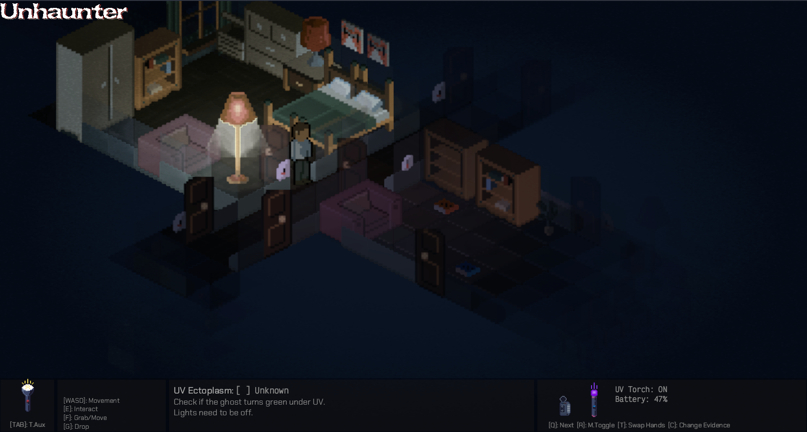
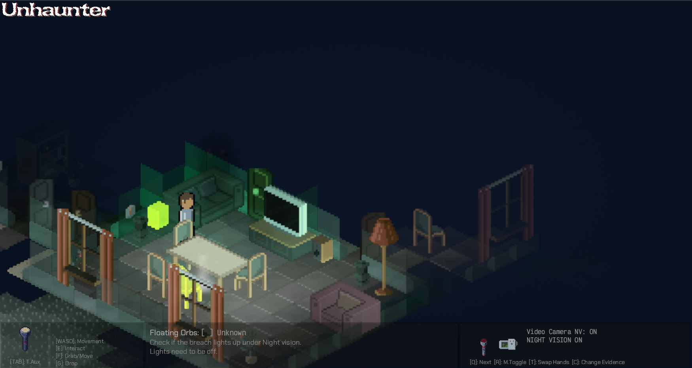
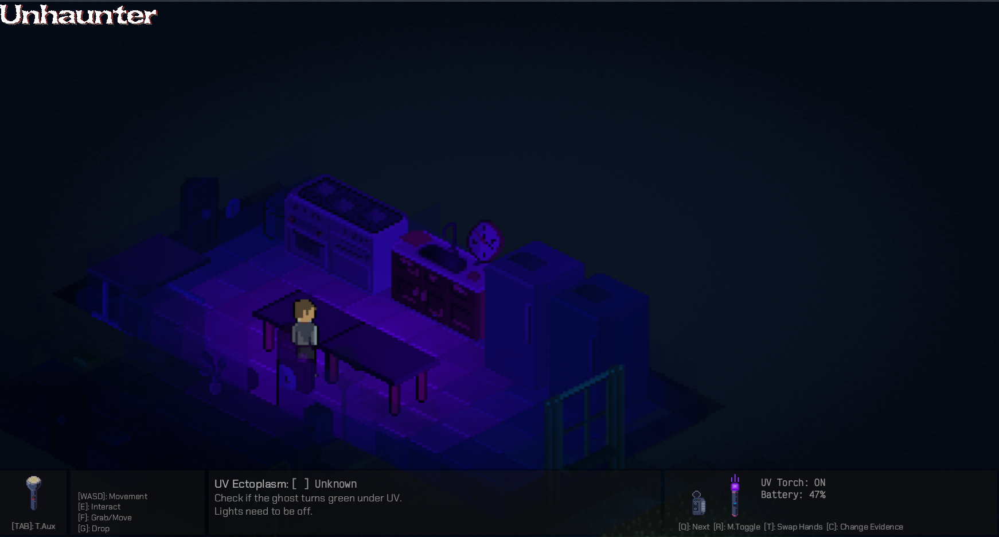

# Unhaunter: Dare to Face the Unseen

Dare to enter a world where shadows whisper and every creak could be a ghostly presence. In Unhaunter, you're a paranormal investigator armed with cutting-edge gear, tasked with identifying and expelling restless spirits from haunted locations.

This 2D isometric game seamlessly blends exploration, puzzle-solving, and strategic investigation, offering a unique blend of thrills and chills for those brave enough to confront the unknown.


    
Here are some screenshots of the game:











Play directly in the browser here: [https://deavid.github.io/unhaunter/](https://deavid.github.io/unhaunter/)

Or compile the game yourself for Windows or Linux following the instructions in this page. It's quite simple.

## Gameplay

### Exploration

Explore atmospheric, isometric environments and unravel their secrets. Venture into dimly lit rooms, interact with objects like doors, switches, and lamps, and uncover clues to help you identify the ghost.

### Investigation

Your ultimate goal is to banish the lingering spirits (currently one per location).

To achieve this, you must first identify the ghost among 44 distinct possible ghost types. Each ghost type interacts with your equipment in a different way, leaving behind specific clues known as evidence.

There are 8 types of evidence. Each ghost exhibits 5 of these 8.

### Ghost Identification

Your first task is to locate the ghost and determine its preferred area.  Look for subtle visual clues like a semi-transparent dust cloud, which indicates the ghost's spawn point (breach). This is often easiest to see with the location's lights (not your flashlight). You can also use your equipment, like the Thermometer, to detect temperature changes, or the EMF meter to find fluctuations in the electromagnetic field. Carefully test your equipment, and record your findings in your trusty van. Once you have enough evidence, synthesize a specialized "Unhaunter Ghost Repellent" to expel the ghost.

Once you're done, you can click "End Mission" on the van and you'll get the mission score.

### Controls

*   **[WASD]:** Movement (or Arrow keys, configurable)
*   **[E]:** Interact (doors, switches, lamps, hiding spots)
*   **[R]:** Activate right-hand gear
*   **[T]:** Swap left and right hand items
*   **[Q]:** Cycle right-hand inventory
*   **[TAB]:** Activate left-hand item
*   **[F]:** Grab item
*   **[G]:** Drop item
*   **[C]:** Record Evidence
*   **[ShiftLeft]:** Run (hold)

### Ghost Hunting

Beware! Ghosts can enter a hunting phase, becoming more aggressive and directly pursuing players to inflict damage. The likelihood of a hunt increases as the ghost's rage grows, and its duration is determined by the ghost's "hunting" state. Before a hunt begins, the ghost will often give a warning, such as a loud roar, giving you time to prepare. During a hunt, you can try to hide behind certain objects by holding down the [E] key. If the ghost catches you during a hunt, it will damage your health.

## Evidence & Equipment

| Evidence       | Gear           | Description                                                                                                                                                                               |
| -------------- | -------------- | ----------------------------------------------------------------------------------------------------------------------------------------------------------------------------------------- |
| Freezing Temps | Thermometer    | The room frequented by the ghost becomes unusually cold. Some ghosts will cause temperatures to drop below 0°C.                                                                           |
| Floating Orbs  | Video Camera   | The ghost's breach (a spectral dust cloud) might glow brightly when viewed through a Night Vision camera.  Lights must be OFF.                                                            |
| UV Ectoplasm   | UV Torch       | Some ghosts will emit a greenish glow under UV light. Lights must be OFF.                                                                                                                 |
| EMF Level 5    | EMF Meter      | The EMF Meter may spike to level 5 in the presence of certain ghosts.  Keep the meter close to the ghost's area of activity.                                                              |
| EVP Recording  | Recorder       | The Recorder might capture ghostly voices (Electronic Voice Phenomena). If a EVP Recording is made, [EVP RECORDED] will appear.                                                           |
| Spirit Box     | Spirit Box     | Screams, whispers, or other paranormal sounds may be heard through the Spirit Box when close to the breach and in relative darkness.                                                      |
| RL Presence    | Red Torch      | Some ghosts glow orange under red light.  Lights must be OFF.                                                                                                                             |
| 500+ cpm       | Geiger Counter | The Geiger Counter measures radiation levels. Some ghosts emit high radiation, registering over 500 counts per minute (cpm). It takes time for the Geiger counter to settle into a value. |

## Basic Strategy

### Quick Tips:

*   **Use your ears:** Pay close attention to audio cues from your equipment (changes in the EMF meter's beeping, the ghost's whispers, etc.).
*   **Control the environment:** Closing doors helps contain cold air for more accurate temperature readings. Lights also heat up the room, so turning them off can create a colder environment.
*  **Hide:** If a hunt starts, press and hold [E] near tables, beds, and other objects to hide itself.
*   **Sanity is key:** Manage your sanity by taking breaks in the truck.

### Finding the Ghost

Your first task is to locate the ghost and determine its preferred area.

The ghost's spawn point, known as its breach, appears as a subtle, semi-transparent dust cloud. It's most visible with the location's lights (not from your torch). The UV Torch will make it glow golden, this is not evidence, but it helps with visual identification.

### Gathering Evidence

Ghosts can move throughout the environment, but you might find more activity near their breach (spawn point). Investigate this area carefully.

For the best results, turn off lights near the breach and close the doors. This will help create a colder environment for more accurate temperature readings and might enhance the visibility of certain paranormal phenomena.

Use your equipment and take note of which ones yield positive results.

### Crafting the Repellent

Return to your van and record the evidence you've gathered in your journal. The crafting of the ghost repellent can only be performed inside the van.

As you record evidence, the list of possible ghosts in your journal will narrow down. Once you're confident in your identification, select the ghost and click "Craft Unhaunter Ghost Repellent".

### Expelling the Ghost

This will create a vial filled with the specific repellent needed to banish that ghost type. Return to the ghost's room (breach), wait for it to appear, and activate the vial.

If successful, the ghost will fade out over several seconds while emitting smoke particles. You'll also hear distinct sounds indicating its departure. Make sure the ghost and its breach are completely gone before ending the mission. You can refill the vial automatically when crafting a new repellent in the van.

Once you're certain there are no more ghosts, go back to the van and click "End Mission".

## Building and Installing

There are no pre-built binaries or installers for Unhaunter. To play, you'll need to build it from source.

1.  Clone the repository:

    ```bash
    $ git clone https://github.com/deavid/unhaunter.git
    ```

## Prerequisites

You'll need to have Rust and the necessary dependencies for Bevy installed.

2.  Install Rust:

    [https://www.rust-lang.org/tools/install](https://www.rust-lang.org/tools/install)

3.  Install Bevy dependencies:

    Follow the instructions for your operating system at:

    [https://bevyengine.org/learn/quick-start/getting-started/setup/#installing-os-dependencies](https://bevyengine.org/learn/quick-start/getting-started/setup/#installing-os-dependencies)

4.  Run the game:

    ```bash
    $ cargo run
    ```

    Run this command from the game's source folder.

**Note:** Unhaunter is being actively developed and built using Bevy version `0.13.0`. While it should run on a wide range of computers, configurations haven't been extensively tested.

## Profiling

If you encounter performance issues, profiling can help identify the bottlenecks. **Warning:** Profiling generates a large amount of data (potentially gigabytes). Be mindful of this and profile only for short durations.

To run a profiling session:

    ```bash
    $ cargo run --release --features bevy/trace_chrome
    ```

    This creates a file named `trace-1999999999999999.json` (the numbers will vary) in the same folder from where you ran `cargo run`.

    **Warning:** The trace file may contain private information about your system. Be cautious about sharing it.

### Inspecting the Trace

1.  **Compress the trace:** The JSON trace file can be compressed significantly. Use 7-Zip or a tool like ZSTD for efficient compression.
2.  **Open the trace:** You can inspect the trace using [https://ui.perfetto.dev](https://ui.perfetto.dev). If the file is too large for the browser's WASM limit, follow the instructions at: [https://perfetto.dev/docs/quickstart/trace-analysis#trace-processor](https://perfetto.dev/docs/quickstart/trace-analysis#trace-processor)
3.  **Analyze the trace:** Zoom in on the timeframe you want to analyze (typically the later portion) and look for the `bevy_app -> winit event_handler -> update -> main_app -> schedule: name=Main -> schedule: name=Update` section. This will reveal the main contributors to frame time.

**Note:** `bevy_framepace::framerate_limiter` will likely take up most of the time, as its purpose is to introduce delays to maintain a consistent FPS.

For more information on profiling Bevy, see:

[https://github.com/bevyengine/bevy/blob/main/docs/profiling.md](https://github.com/bevyengine/bevy/blob/main/docs/profiling.md)

## WASM Support

A WASM version of Unhaunter is available to play directly in your web browser:

[https://deavid.github.io/unhaunter/](https://deavid.github.io/unhaunter/)

Please note that this version is primarily intended as a demo.

For the best experience, we recommend playing the native build.

**Note:** Google Chrome is the recommended browser for the best experience.

### Current WASM Limitations:

*   Performance issues may occur in Firefox.
*   Single-thread only.

This WASM version is intended as a demo for those who cannot build the game locally. Unhaunter primarily targets native builds, so WASM support will be minimal for now.

## Faster Compile Times

### Dynamic Linking

Using dynamic linking for incremental builds (small code changes) can significantly reduce compile times:

```bash
cargo run --features bevy/dynamic_linking
```

This is mainly beneficial for debug builds. For fresh builds, the difference is negligible.

You can profile the build process to identify further optimizations using:

```bash
RUSTFLAGS="-Zself-profile" cargo +nightly run --features bevy/dynamic_linking
```

**Note:** This requires a nightly Rust toolchain.

## Building WASM locally:

https://bevy-cheatbook.github.io/platforms/wasm.html

Install deps

```bash
rustup target install wasm32-unknown-unknown
cargo install wasm-server-runner
```

Run with:

```bash
wasm-pack build --release --target web
```

This will build in pkg/

And to test:

```bash
python3 -m http.server
```

## Faster development incremental builds

Incremental builds on Linux can be much faster if you use `mold`. I decided to not enable it on the project because it would force everyone building from Linux to install it in order to build the game, adding a dependency.

Instead, if you're interested, you can edit `~/.cargo/config.toml` (create the folder and file if they don't exist) and add this:

```
# Use Mold Linker for faster builds
[target.x86_64-unknown-linux-gnu]
linker = "clang"
rustflags = ["-C", "link-arg=-fuse-ld=/usr/bin/mold"]
```  

You'll need to install `mold` and `clang`.

This is only useful for incremental builds, for example if you are actively developing the game. Also this these speeds are possible only using Bevy dynamic linking (`cargo run --features bevy/dynamic_linking`).

With Rust default Linker:

*   Crate `uncore` changed: 4.93s (triggers all Unhaunter crates to be rebuilt)
*   Crate `unhaunter` changed: 3.74s (Just builds library + binary)

With Mold Linker:

*   Crate `uncore` changed: 3.32s
*   Crate `unhaunter` changed: 1.87s

This is only worth it if you plan to compile Unhaunter a lot with different small changes. If you only update Unhaunter on new releases, this difference is virtually nothing since you'll need to build all dependencies that have been upgraded.

## Community

Unhaunter has a Matrix room for discussion and collaboration. Access public, anyone can join.

[Matrix Room](https://matrix.to/#/#unhaunter:matrix.org)
