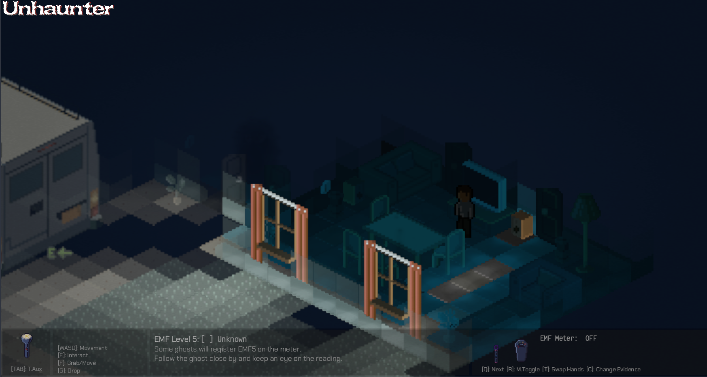
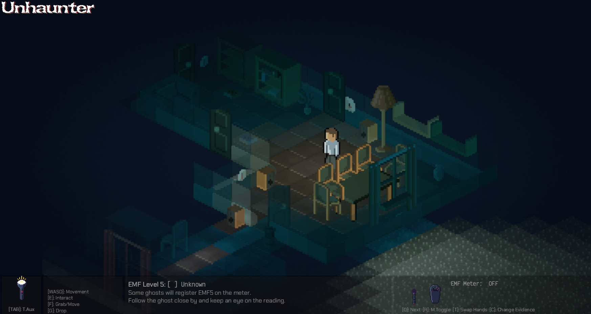
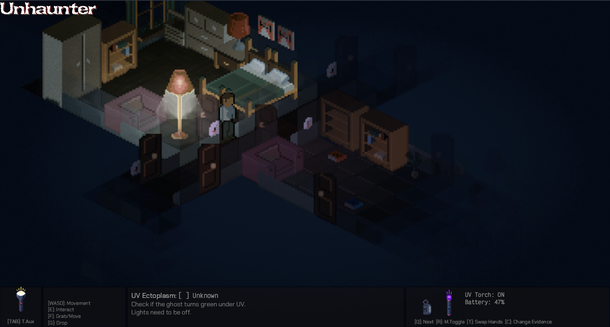
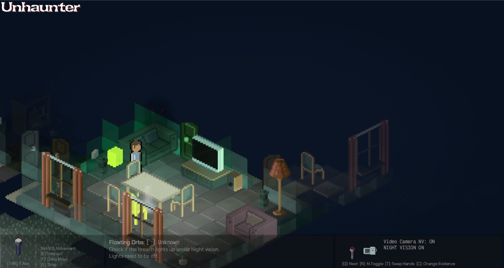
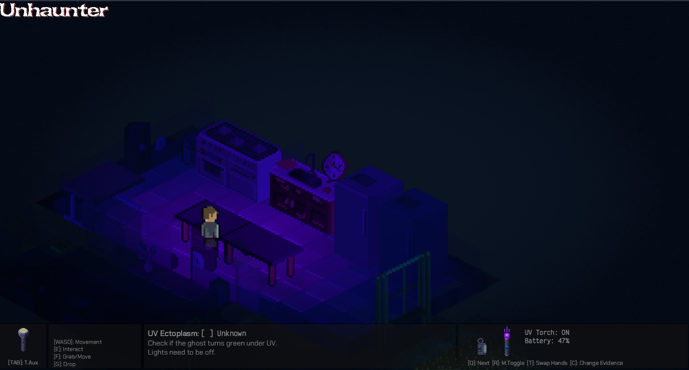

# Unhaunter: Dare to Face the Unseen

Dare to enter a world where shadows whisper and every creak could be a ghostly presence. In Unhaunter, you're a
paranormal investigator armed with cutting-edge gear, tasked with identifying and expelling restless spirits from
haunted locations.

This 2D isometric game seamlessly blends exploration, puzzle-solving, and strategic investigation, offering a unique
blend of thrills and chills for those brave enough to confront the unknown.

Join our discord server:

[](https://discord.gg/Ux7CGfvVtV)

Check the game website: [Unhaunter.com](https://www.unhaunter.com/)

The game can be played from the browser, [click here](https://www.unhaunter.com/) for more instructions.

Here are some screenshots of the game:











## Gameplay

### Core Loop

1. **Explore & Locate:** Venture into haunted locations and find the ghost's **breach**—the portal it uses to enter our
   world.
2. **Gather Evidence:** Use specialized equipment to identify which of the 44 ghost types is present.
3. **Manipulate the Environment:** Use **Haunted Objects** to attract or repel the ghost, shifting its behavior to your
   advantage.
4. **Assistance:** Listen to your **Walkie-Talkie Buddy** for vital hints and warnings about your sanity and ghost
   activity.
5. **Identify & Craft:** Once you have 5 out of 8 pieces of evidence, return to the van to craft a unique **Ghost
   Repellent**.
6. **Expel:** Confront the ghost with the repellent to banish it and complete the mission.

### Intuitive Controls & Exploration

Navigate the world with ease using either traditional **WASD** keys or **modern mouse controls**. Click to walk with
built-in pathfinding, and use your mouse to naturally aim your flashlight as you scan for ghosts.

Explore atmospheric, multi-floor environments with dynamic **isometric lighting**. The game features realistic **eye
adaptation**, where your vision adjusts as you move between dark hallways and brightly lit rooms.

Be wary of the **Miasma**—a thick, spectral fog that flows through the location. Standing in the miasma is oppressive
and will drain your stamina faster when you try to run.

### Tactical Equipment & Journal

Your **Journal** is your most powerful tool. It automatically filters potential ghosts based on the evidence you record,
and even helps you determine the correct repellent to craft.

As you investigate, manage the building's **Fuse Box** carefully. Turning on too many lights can overload the circuit
and plunge the entire location into darkness, forcing you to find the breaker to restore power. When things get intense,
watch for visual feedback—your **Ghost Repellent** will glow electric blue when it hits the correct spirit, or bright
red if you've made a mistake.

### Haunted Objects

Some objects in the house are not what they seem. These **Haunted Objects** can be **Attractive** or **Repulsive** to
ghosts. You can use this to your advantage:

- **Locate them:** Use your **UV Torch**, **Red Light**, or **Night Vision Camera** to spot the telltale spectral glow
  of a haunted item.
- **Tactical Control:** Moving these items allows you to influence where the ghost roams or even provoke a hunt if you
  need to gather specific evidence.

### Survival & Hiding

Beware! Ghosts can enter a **Hunting Phase**, becoming aggressive and pursuing players to inflict damage. The likelihood
of a hunt increases as the ghost's rage grows. Before a hunt begins, the ghost will often give a warning, such as a loud
roar or a drop in ambient audio.

If you can't reach the safety of your van, you must **Hide**. By holding the **Interact [E]** key near beds, tables, or
other hiding spots, your character will take cover. While hidden, the ghost will have a much harder time spotting
you—just make sure you aren't seen entering your hiding spot! If the ghost catches you during a hunt, it will damage
your health.

### Progression & Campaign

Embark on a full **Campaign** featuring over 15 unique maps. As you successfully complete investigations, you'll earn
**Experience (XP)** and **Money**, allowing you to level up and take on more challenging missions. Each mission is
graded from **A to F** based on your performance and bravery.

## Design Philosophy

Unhaunter is built on several core architectural and psychological pillars that distinguish it from other paranormal
investigation games. For a deep dive into our vision, see [docs/DESIGN_PHILOSOPHY.md](docs/DESIGN_PHILOSOPHY.md).

- **Liminal Horror over PagerDuty Simulation:** We prioritize atmosphere and "Gear 3" tension over synthetic stress and
  tool-clutter.
- **Zero-Ops Networking:** A "RAM-only" Hub architecture designed for frictionless community-run servers and GDPR
  compliance.
- **Friction Architecture:** A unique security model that taxes a troll's time through Reputation economies rather than
  simple bans.
- **Distributed Authority:** A multiplayer model where players own their movement and gear locally for zero-latency
  gameplay, while the environment remains server-authoritative.

## Controls

- **[WASD]:** Movement (or Arrow keys, configurable)
- **[E]:** Interact (doors, switches, lamps, hiding spots)
- **[R]:** Activate right-hand gear
- **[T]:** Swap left and right hand items
- **[Q]:** Cycle right-hand inventory
- **[TAB]:** Activate left-hand item
- **[F]:** Grab item
- **[G]:** Drop item
- **[C]:** Record Evidence
- **[ShiftLeft]:** Run (hold)

## Evidence & Equipment

| Evidence       | Gear           | Description                                                                                                                                                                               |
| -------------- | -------------- | ----------------------------------------------------------------------------------------------------------------------------------------------------------------------------------------- |
| Freezing Temps | Thermometer    | The room frequented by the ghost becomes unusually cold. Some ghosts will cause temperatures to drop below 0°C.                                                                           |
| Floating Orbs  | Video Camera   | The ghost's breach (a spectral dust cloud) might glow brightly when viewed through a Night Vision camera. Lights must be OFF.                                                             |
| UV Ectoplasm   | UV Torch       | Some ghosts will emit a greenish glow under UV light. Lights must be OFF.                                                                                                                 |
| EMF Level 5    | EMF Meter      | The EMF Meter may spike to level 5 in the presence of certain ghosts. Keep the meter close to the ghost's area of activity.                                                               |
| EVP Recording  | Recorder       | The Recorder might capture ghostly voices (Electronic Voice Phenomena). If a EVP Recording is made, [EVP RECORDED] will appear.                                                           |
| Spirit Box     | Spirit Box     | Screams, whispers, or other paranormal sounds may be heard through the Spirit Box when close to the breach and in relative darkness.                                                      |
| RL Presence    | Red Torch      | Some ghosts glow orange under red light. Lights must be OFF.                                                                                                                              |
| 500+ cpm       | Geiger Counter | The Geiger Counter measures radiation levels. Some ghosts emit high radiation, registering over 500 counts per minute (cpm). It takes time for the Geiger counter to settle into a value. |

## Quick Tips

- **Use your ears:** Pay close attention to audio cues from your equipment (changes in the EMF meter's beeping, the
  ghost's whispers, etc.).
- **Control the environment:** Closing doors helps contain cold air for more accurate temperature readings. Lights also
  heat up the room, so turning them off can create a colder environment.
- **Hide:** If a hunt starts, press and hold **[E]** near tables, beds, and other objects to hide.
- **Sanity is key:** Manage your sanity by taking breaks in the truck and listening to your buddy's warnings.
- **Visual Cues:** The ghost's **breach** (spawn point) is a subtle dust cloud, best seen with the room's lights. Your
  UV Torch will make it glow gold, helping you find the center of activity.

## Building and Installing

Everyone is welcome to try the game from sources or do their own changes. You can just try to play from source code,
it's easy.

1. Clone the repository:

   ```bash
   git clone https://github.com/deavid/unhaunter.git
   ```

## Prerequisites

You'll need to have Rust and the necessary dependencies for Bevy installed.

1. Install Rust:

   [https://www.rust-lang.org/tools/install](https://www.rust-lang.org/tools/install)

2. Install Bevy dependencies:

   Follow the instructions for your operating system at:

   [https://bevyengine.org/learn/quick-start/getting-started/setup/#installing-os-dependencies](https://bevyengine.org/learn/quick-start/getting-started/setup/#installing-os-dependencies)

3. Run the game:

   ```bash
   cargo run
   ```

   Run this command from the game's source folder.

## Profiling

If you encounter performance issues, profiling can help identify the bottlenecks. **Warning:** Profiling generates a
large amount of data (potentially gigabytes). Be mindful of this and profile only for short durations.

To run a profiling session:

    ```bash
    cargo run --release --features bevy/trace_chrome
    ```

    This creates a file named `trace-1999999999999999.json` (the numbers will vary) in the same folder from where you ran `cargo run`.

    **Warning:** The trace file may contain private information about your system. Be cautious about sharing it.

### Inspecting the Trace

1. **Compress the trace:** The JSON trace file can be compressed significantly. Use 7-Zip or a tool like ZSTD for
   efficient compression.
2. **Open the trace:** You can inspect the trace using [https://ui.perfetto.dev](https://ui.perfetto.dev). If the file
   is too large for the browser's WASM limit, follow the instructions at:
   [https://perfetto.dev/docs/quickstart/trace-analysis#trace-processor](https://perfetto.dev/docs/quickstart/trace-analysis#trace-processor)
3. **Analyze the trace:** Zoom in on the timeframe you want to analyze (typically the later portion) and look for the
   `bevy_app -> winit event_handler -> update -> main_app -> schedule: name=Main -> schedule: name=Update` section. This
   will reveal the main contributors to frame time.

**Note:** `bevy_framepace::framerate_limiter` will likely take up most of the time, as its purpose is to introduce
delays to maintain a consistent FPS.

For more information on profiling Bevy, see:

[https://github.com/bevyengine/bevy/blob/main/docs/profiling.md](https://github.com/bevyengine/bevy/blob/main/docs/profiling.md)

## WASM Support

A WASM version of Unhaunter is available to play directly in your web browser:

[See more instructions on Unhaunter.com](https://www.unhaunter.com/)

Please note that this version is primarily intended as a demo.

For the best experience, we recommend playing the native build.

**Note:** Google Chrome is the recommended browser for the best experience.

### Current WASM Limitations

- Performance issues may occur in Firefox.
- Single-thread only.

This WASM version is intended as a demo for those who cannot build the game locally. Unhaunter primarily targets native
builds, so WASM support will be minimal for now.

## Faster Compile Times

### Dynamic Linking

Using dynamic linking for incremental builds (small code changes) can significantly reduce compile times:

```bash
cargo run --features bevy/dynamic_linking
```

This is mainly beneficial for debug builds. For fresh builds, the difference is negligible. This only works on Linux.

You can profile the build process to identify further optimizations using:

```bash
RUSTFLAGS="-Zself-profile" cargo +nightly run --features bevy/dynamic_linking
```

**Note:** This requires a nightly Rust toolchain.

## Building WASM locally

<https://bevy-cheatbook.github.io/platforms/wasm.html>

Install deps

```bash
rustup target install wasm32-unknown-unknown
cargo install wasm-server-runner
cargo install wasm-pack
```

Run with:

```bash
wasm-pack build --release --target web
```

This will build in pkg/

And to test:

```bash
python3 -m http.server
```

## Faster development incremental builds

Incremental builds on Linux can be much faster if you use `mold`. I decided to not enable it on the project because it
would force everyone building from Linux to install it in order to build the game, adding a dependency.

Instead, if you're interested, you can edit `~/.cargo/config.toml` (create the folder and file if they don't exist) and
add this:

```toml
# Use Mold Linker for faster builds
[target.x86_64-unknown-linux-gnu]
linker = "clang"
rustflags = ["-C", "link-arg=-fuse-ld=/usr/bin/mold"]
```

You'll need to install `mold` and `clang`.

This is only useful for incremental builds, for example if you are actively developing the game. Also this these speeds
are possible only using Bevy dynamic linking (`cargo run --features bevy/dynamic_linking`).

With Rust default Linker:

- Crate `uncore` changed: 4.93s (triggers all Unhaunter crates to be rebuilt)
- Crate `unhaunter` changed: 3.74s (Just builds library + binary)

With Mold Linker:

- Crate `uncore` changed: 3.32s
- Crate `unhaunter` changed: 1.87s

This is only worth it if you plan to compile Unhaunter a lot with different small changes. If you only update Unhaunter
on new releases, this difference is virtually nothing since you'll need to build all dependencies that have been
upgraded.

## Community

Unhaunter has a Matrix room for discussion and collaboration. Access public, anyone can join. We also have a Discord
server.

- [Matrix Room](https://matrix.to/#/#unhaunter:matrix.org)
- [Discord Server](https://discord.gg/Ux7CGfvVtV)
